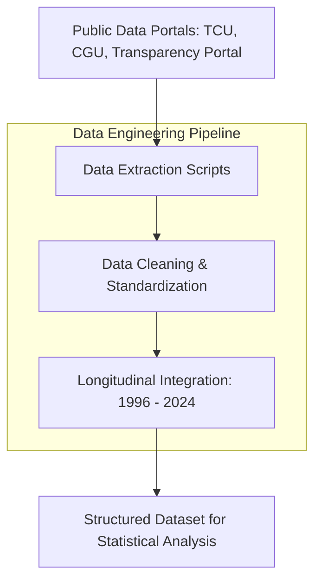

This project was developed to support the doctoral research of Prof. Lincoln Telhado (PhD in Political Science, USP). The project focuses on the intricate processes of **Special Accounts Accountability (Tomada de Contas Especial - TCE)** within the Brazilian federal government.

The core objective is to enable a statistical investigation into the nature of internal control and the evolving role of Ministries versus the Office of the Comptroller General (CGU) in the accountability process from 1996 to 2024.

---

### The Challenge

Analyzing public accountability in Brazil requires navigating a fragmented landscape of open data portals. The challenge lies in extracting, cleaning, and consolidating disparate datasets from multiple federal entities—including the **Federal Court of Accounts (TCU)**, the **Office of the Comptroller General (CGU)**, and the **Transparency Portal**.

These datasets cover nearly three decades of federal agreements (*convênios*) between ministries and municipalities, presenting significant inconsistencies in formatting, naming conventions, and data quality over time.

---

### Technical Implementation

I developed a robust ETL (Extract, Transform, Load) pipeline to transform raw public data into a research-ready format:

* **Data Extraction & Cleaning:** Automated scripts to fetch and sanitize data from multiple public APIs and open data repositories.
* **Transformation:** Standardizing variables across 28 years of records to ensure longitudinal consistency for statistical modeling.
* **Feature Engineering:** Structuring data to highlight relationships between ministries, municipalities, and the outcomes of accountability processes.

### Impact

By bridging the gap between raw public records and academic research, this project provides the empirical foundation for analyzing how internal control mechanisms have shifted in Brazil over the last few decades. It highlights the intersection of Data Science and Institutional Analysis, proving how technical pipelines can empower deep social science insights.

### Tech Stack

Languages: Python (Pandas, NumPy)
Data Sources: TCU, CGU, and Federal Transparency Portal
Focus Areas: Data Cleaning, ETL, Public Transparency, Political Science

**Tech Stack:** `Python` `ETL` `Data Cleaning` `Open Data`