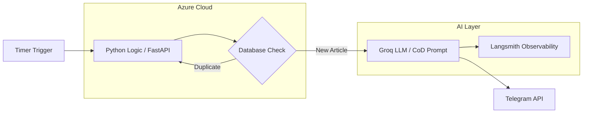

### Comma: Never a Period, Always a Comma

In the midst of an overwhelming volume of newsletters and countless tech sources, staying updated has become a challenge. **Comma** is a serverless curation bot designed to solve this by delivering a single, carefully selected article about AI and technology daily, ensuring relevance without the noise.

The name reflects the project's core philosophy: in writing, a comma signifies a pause, not a full stop. It suggests that the journey of knowledge is continuous—there is always another idea to explore, another connection to be made.

---

### The Challenge & Evolution

The project originated from my personal difficulty in keeping up with high-quality tech news in an industry that evolves daily. 

An initial version of the bot failed due to low adoption, which provided a valuable lesson: **Technical excellence isn't enough without a great User Experience (UX)**. This led to a pivot focusing on a seamless, cross-platform experience that integrates directly into the user's daily workflow via messaging platforms.

---

### Technical Architecture

The system follows a serverless logic designed for efficiency, reliability, and high-quality content synthesis.

To ensure the summaries are both concise and informative, I implemented a **GenAI/LLM (Groq)** pipeline using the **Chain-of-Density (CoD)** prompt strategy. This state-of-the-art approach allows the bot to condense content progressively without losing critical entities or facts.

**Key Features:**
* **Serverless Execution:** Operates via a Timer Trigger for fully automated daily delivery.
* **Smart Selection:** Uses random selection from curated sources with "Retry loop" logic to guarantee a fresh article every day.
* **Duplicate Prevention:** Integrated database connection to ensure the same article is never sent twice.
* **Cross-Platform Delivery:** Designed to send messages across multiple platforms, currently integrated with **Telegram**.

---

### Tech Stack

* **Language:** Python 
* **Frameworks:** FastAPI 
* **AI/LLM:** Groq (using Chain-of-Density prompting) 
* **Infrastructure:** Docker & Uvicorn 
* **Cloud:** Azure 
* **Observability:** Langsmith 

---

### Future Roadmap

The next phase for Comma involves implementing a full **CI/CD pipeline** with GitHub Actions to automate deployments and further refining the recommendation engine based on user engagement.

[Link to GitHub Repository](https://github.com/pedrofernandss/comma)

**Tech Stack:** `Python` `Azure` `Docker` `FastAPI` `Groq`